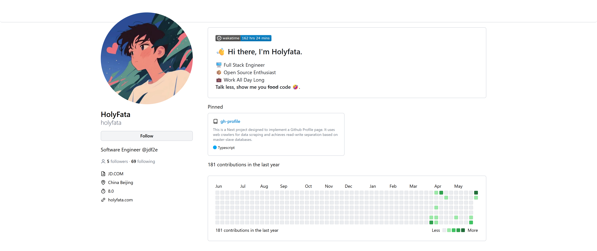

# GitHub Profile

<!-- automd:badges github="holyfata/gh-profile" license licenseBranch="master" -->

<!-- /automd -->

> This is a Next project designed to implement a Github Profile page. It uses web crawlers for data scraping and achieves read-write separation based on master-slave databases.

  

## Contributors

<!-- automd:contributors github="holyfata/gh-profile" author="holyfata" license="MIT" -->

Published under the [MIT](https://github.com/holyfata/gh-profile/blob/main/LICENSE) license.
Made by [@holyfata](https://github.com/holyfata) and [community](https://github.com/holyfata/gh-profile/graphs/contributors) 💛
  

<!-- /automd -->

<!-- automd:with-automd -->

---

_🤖 auto updated with [automd](https://automd.unjs.io)_

<!-- /automd -->
